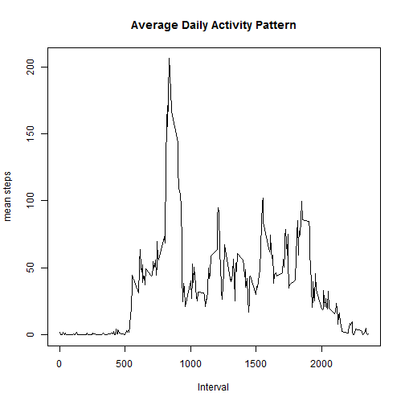
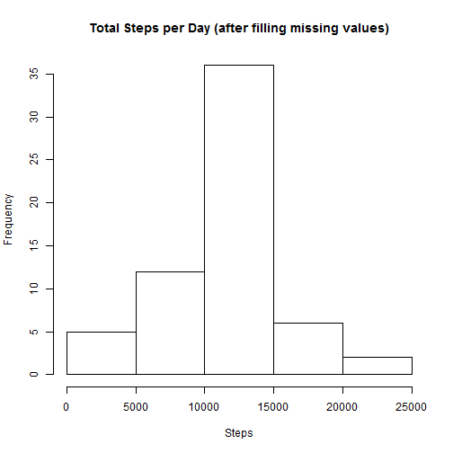

# Reproducible Research: Peer Assessment 1


## Loading and preprocessing the data

```r
fileUrl <- "https://d396qusza40orc.cloudfront.net/repdata%2Fdata%2Factivity.zip"
localFilename <- "activity.zip"

if (!file.exists(localFilename)) {
    download.file(fileUrl, destfile = localFilename, mode = "wb")
} 

dataFileList <- unzip(localFilename,list = TRUE)

if (!file.exists("data")) {  
  unzip(localFilename, overwrite=FALSE, exdir="data")
}

activityData <- read.csv("./data/activity.csv")
```

## What is mean, median total number of steps taken per day?


```r
require(plyr)
summ1 <- ddply(activityData, "date", summarize,
               totalSteps = sum(steps),
               medianSteps = median(steps, na.rm=TRUE))
hist(summ1$totalSteps, 
     xlab = "Total Steps per Day",
     main = NULL)
```

 

```r
mean(summ1$totalSteps, na.rm=TRUE)
```

```
## [1] 10766
```

```r
median(summ1$totalSteps, na.rm=TRUE)
```

```
## [1] 10765
```

## What is the average daily activity pattern?


```r
summ2 <- ddply(activityData, "interval", summarize,
                meanSteps = mean(steps, na.rm=TRUE))
require(ggplot2)
plot2 <- qplot(summ2$interval, summ2$meanSteps, 
               xlab="Interval", ylab="mean number of steps",
               geom="line")
print(plot2)
```

 

```r
summ2[order(summ2$meanSteps, decreasing=TRUE)[1],1]
```

```
## [1] 835
```

```r
summ2$interval <- as.factor(summ2$interval)
```

```r
## Imputing missing values
```

```r
miss = is.na(activityData$steps)
print(sum(miss))
```

```
## [1] 2304
```

```r
# fill in missing data: first check if there are insufficient past points
# to fill in the data using moving average, in which case use the mean value
# for that time interval, else fill in the missing data point with the mean
# of the preceeding values within a specified window

meanWindow = 12
missIndexes <- which(miss)
mungedActivityData <- activityData
replaceByMean <- rep(FALSE, length(missIndexes))
replaceByMovingAverage <- rep(FALSE, length(missIndexes))
for (j in 1:length(missIndexes)) {
    i <- missIndexes[j]
    countMissPast <- sum(missIndexes >= i-meanWindow & missIndexes <= i-1)
    if ((i < meanWindow) || (countMissPast > 0)) {
        mungedActivityData$steps[i] <- with(summ2,
                meanSteps[interval == as.character(mungedActivityData$interval[i])])
        replaceByMean[j] <- TRUE
    } else {
        mungedActivityData$steps[i] <- 
                mean(mungedActivityData$steps[(i-meanWindow):(i-1)])
        replaceByMovingAverage[j] <- TRUE
    }
}
print(paste(sum(replaceByMean),
            " missing values replaced using mean at corresponding interval"))
```

```
## [1] "2298  missing values replaced using mean at corresponding interval"
```

```r
print(paste(sum(replaceByMovingAverage),
            " missing values replaced using moving average of past ",
            meanWindow, " data points"))
```

```
## [1] "6  missing values replaced using moving average of past  12  data points"
```

## What is mean, median total number of steps taken per day after filling missing values?


```r
require(plyr)
summ4 <- ddply(mungedActivityData, "date", summarize,
               totalSteps = sum(steps),
               medianSteps = median(steps, na.rm=TRUE))
hist(summ4$totalSteps, 
     xlab = "Total Steps per Day",
     main = NULL)
```

 

```r
mean(summ4$totalSteps)
```

```
## [1] 10766
```

```r
median(summ4$totalSteps)
```

```
## [1] 10764
```

## Are there differences in activity patterns between weekdays and weekends?


```r
# add factor column to identify weekdays vs. weekends. Note that when performing
# the substitution, R capitalizes the first letter in the character string

mungedActivityData$date <- as.Date(mungedActivityData$date)
mungedActivityData$dayType <- weekdays(mungedActivityData$date)
mungedActivityData$dayType <- gsub("Saturday|Sunday","weekend",mungedActivityData$dayType)
wkdyIndices <- grep("[Ww]eekend", mungedActivityData$dayType, invert = TRUE)
mungedActivityData$dayType[wkdyIndices] <- "weekday"

require(plyr)
summ5 <- ddply(mungedActivityData, c("interval","dayType") , summarize,
               totalSteps = sum(steps),
               medianSteps = median(steps),
               meanSteps = mean(steps))

require(lattice)
plt5 <- xyplot(meanSteps ~ interval | dayType, summ5, layout = c(1,2),
                           type = "l", xlab = "Interval", ylab = "Number of Steps")
print(plt5)
```

 
